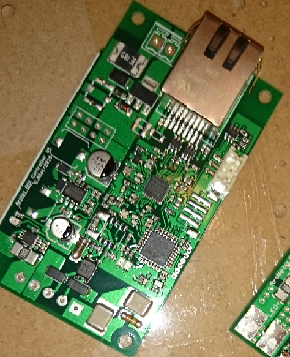

# ArtNet DMX Controller
This is a small LED controller for DMX LED spots, which can be accessed and controlled through the ArtNet protocol over Ethernet.

## Assembled PCB

##  LICENSE
The contents of this repository are covered under the [MIT License](./LICENSE).